# GATLING + MAVEN + DOCKER

Menjalankan gatling untuk loading test mengguanankan plugin maven yang dijalankan di atas docker. kita kan menggunakan dummy rest api example sebagai target load test kita. public api yang akan kita test ditampilkan pada table dibawah ini. 

Base Url : http://dummy.restapiexample.com/api/v1

- api details

    | No   | Route   | Method   | Type   | Full Route   | Description| 
    |---|---|---|---|---|---|
    | 1   | /employee  | GET  | JSON   | http://dummy.restapiexample.com/api/v1/employees   | Get all employee data   |
    | 2  | /employee/{id}  | GET  | JSON   | http://dummy.restapiexample.com/api/v1/employee/1  | Get a single employee data  |
    | 3  | /create  | POST   | JSON  | http://dummy.restapiexample.com/api/v1/create  | Create new record in database  |
    | 4  | /update/{id}  | PUT  | JSON  | http://dummy.restapiexample.com/api/v1/update/21  | Update an employee record  |
    | 5  | /delete/{id}  | DELETE  | JSON  | http://dummy.restapiexample.com/api/v1/delete/2  | Delete an employee record  |

- Response
    1. get all data
        ```json
        {
            "status": "success",
            "data": [
                {
                "id": "1",
                "employee_name": "Tiger Nixon",
                "employee_salary": "320800",
                "employee_age": "61",
                "profile_image": ""
                },
                {
                "id": "2",
                "employee_name": "Garrett Winters",
                "employee_salary": "170750",
                "employee_age": "63",
                "profile_image": ""
                },
                {
                "id": "3",
                "employee_name": "Ashton Cox",
                "employee_salary": "86000",
                "employee_age": "66",
                "profile_image": ""
                },
                {
                "id": "4",
                "employee_name": "Cedric Kelly",
                "employee_salary": "433060",
                "employee_age": "22",
                "profile_image": ""
                },
                {
                "id": "5",
                "employee_name": "Airi Satou",
                "employee_salary": "162700",
                "employee_age": "33",
                "profile_image": ""
                },
                {
                "id": "6",
                "employee_name": "Brielle Williamson",
                "employee_salary": "372000",
                "employee_age": "61",
                "profile_image": ""
                },
                {
                "id": "7",
                "employee_name": "Herrod Chandler",
                "employee_salary": "137500",
                "employee_age": "59",
                "profile_image": ""
                },
                {
                "id": "8",
                "employee_name": "Rhona Davidson",
                "employee_salary": "327900",
                "employee_age": "55",
                "profile_image": ""
                },
                {
                "id": "9",
                "employee_name": "Colleen Hurst",
                "employee_salary": "205500",
                "employee_age": "39",
                "profile_image": ""
                },
                {
                "id": "10",
                "employee_name": "Sonya Frost",
                "employee_salary": "103600",
                "employee_age": "23",
                "profile_image": ""
                },
                {
                "id": "11",
                "employee_name": "Jena Gaines",
                "employee_salary": "90560",
                "employee_age": "30",
                "profile_image": ""
                },
                {
                "id": "12",
                "employee_name": "Quinn Flynn",
                "employee_salary": "342000",
                "employee_age": "22",
                "profile_image": ""
                },
                {
                "id": "13",
                "employee_name": "Charde Marshall",
                "employee_salary": "470600",
                "employee_age": "36",
                "profile_image": ""
                },
                {
                "id": "14",
                "employee_name": "Haley Kennedy",
                "employee_salary": "313500",
                "employee_age": "43",
                "profile_image": ""
                },
                {
                "id": "15",
                "employee_name": "Tatyana Fitzpatrick",
                "employee_salary": "385750",
                "employee_age": "19",
                "profile_image": ""
                },
                {
                "id": "16",
                "employee_name": "Michael Silva",
                "employee_salary": "198500",
                "employee_age": "66",
                "profile_image": ""
                },
                {
                "id": "17",
                "employee_name": "Paul Byrd",
                "employee_salary": "725000",
                "employee_age": "64",
                "profile_image": ""
                },
                {
                "id": "18",
                "employee_name": "Gloria Little",
                "employee_salary": "237500",
                "employee_age": "59",
                "profile_image": ""
                },
                {
                "id": "19",
                "employee_name": "Bradley Greer",
                "employee_salary": "132000",
                "employee_age": "41",
                "profile_image": ""
                },
                {
                "id": "20",
                "employee_name": "Dai Rios",
                "employee_salary": "217500",
                "employee_age": "35",
                "profile_image": ""
                },
                {
                "id": "21",
                "employee_name": "Jenette Caldwell",
                "employee_salary": "345000",
                "employee_age": "30",
                "profile_image": ""
                },
                {
                "id": "22",
                "employee_name": "Yuri Berry",
                "employee_salary": "675000",
                "employee_age": "40",
                "profile_image": ""
                },
                {
                "id": "23",
                "employee_name": "Caesar Vance",
                "employee_salary": "106450",
                "employee_age": "21",
                "profile_image": ""
                },
                {
                "id": "24",
                "employee_name": "Doris Wilder",
                "employee_salary": "85600",
                "employee_age": "23",
                "profile_image": ""
                }
            ]
        }
        ```
    2. create data
        ```json
        {
            "status": "success",
            "data": {
                "name": "ade",
                "salary": " 124",
                "age": " 23",
                "id": 51
            }
        }
        ```
    3. get data by id
        ```json
        {
            "status": "success",
            "data": {
                "id": "1",
                "employee_name": "Tiger Nixon",
                "employee_salary": "320800",
                "employee_age": "61",
                "profile_image": ""
            }
        }
        ```


## 1. GATLING-HTTP2
- Mengatur http2 protokol dapat dilakukan sebagaimana contoh berikut :
    ```scala
    val httpProtocol = http.baseUrl("host-name").enableHttp2
    ```

## 2. GATLING-FEEDER-BODY
- Data disimpan pada path resources/data, sebagai contoh pada file resources/data/create-employee.csv dengan data berikut :
    ```csv
    name,salary, age
    ade, 124, 23
    tobil, 345, 26
    suhada, 135, 25
    ```
- Data Body request disimpan pada path resources/bodies pada resources/bodies/create-body.json
    - body json
        ```json
        {
            "name":"${name}",
            "salary":"${salary}",
            "age":"${age}"
        }
        ```
    - keterangan
        ```
        ${name}     --> memuat value name dari data feeder csv
        ${salary}   --> memuat value salary dari data feeder csv
        ${age}      --> memuat value age dari data feeder csv
        ```

## 3. GATLING-SAVE-RESPONSE
- Silahkan challenge teman2 untuk menyimpan data response

## 4. GATLING-CHECK
- cek response data untuk kemudian akan diklasifikasikan sebagai fail atau tidak, bisa dianggap sebagai saringan untuk mengecek hasil test

## 5. RUN MAVEN PROJECT
```bash
# run
mvn gatling:test
```


## 6. IMPLEMENTASI
Loading test menggunakan gatling dapat dilakukan dengan merujuk ke project example yang disediakan oleh gatling, disini kita akan menggunakan gatling dengan maven [lihat repository nya disini](https://github.com/gatling/gatling-maven-plugin-demo).
1. clone project
    ```bash
    git clone git@github.com:gatling/gatling-maven-plugin-demo.git
    ```
    <p align="center">
        <a href="" target="blank">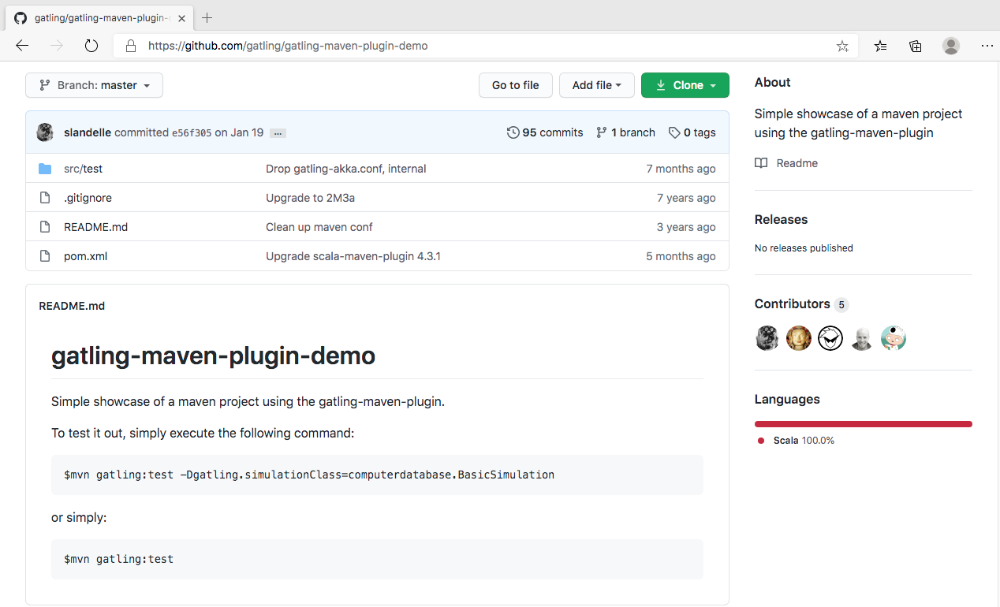</a>
    </p>
    <p align="center">Gatling Maven Repo</p>
2. Rename computerdatabase menjadi dummyapi, atau bisa disesuaikan dengan kebutuhan teman-teman
    <p align="center">
        <a href="" target="blank">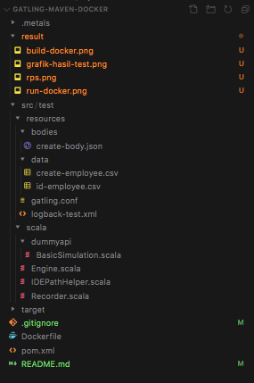</a>
    </p>
    <p align="center">Struktur Directory Project</p>
3. Resources/scala/duummyapi/BasicSimulation
    ```scala
    package dummyapi

    import io.gatling.core.Predef._
    import io.gatling.http.Predef._
    import scala.concurrent.duration._

    class BasicSimulation extends Simulation {

    val httpProtocol = http
        .baseUrl("http://dummy.restapiexample.com/api/v1") // Here is the root for all relative URLs
        
    object Dummy{

        // feeder 
        val csvFeederCreate = csv("data/create-employee.csv").readRecords
        val csvFeederId = csv("data/id-employee.csv").readRecords

        // run test 
        val runTest = exec(http("dummy rest api - get all employee data")
        .get("/employees")
        .check(bodyString.saveAs("response_body")))
        .exec(session => {
            val response = session("response_body").as[String]
            println("\n\nResponse Body\n")
            println(response)
            println("\n\n")
            session
        })
        .pause(2) // pause kemudian hit untuk create user employee
        .foreach(csvFeederCreate, "feeder"){
            exec(flattenMapIntoAttributes("${feeder}"))
            .exec(http("dummy rest api - create employee")
            .post("/create")
            .header("Content-Type", "application/json")
            .header("Accept-Type", "application/json")
            .body(ElFileBody("bodies/create-body.json")).asJson
            .check(bodyString.saveAs("response_body")))
            .exec(session => {
                val response = session("response_body").as[String]
                println("\n\nResponse Body\n")
                println(response)
                println("\n\n")
                session
            })
        }
        .pause(2) // pause kemudian hit untuk get user employee based on user id
        .foreach(csvFeederId, "feeder"){
            exec(flattenMapIntoAttributes("${feeder}"))
            .exec(http("dummy rest api - get employee based on user id")
            .get("/employee/${id}")
            .header("Content-Type", "application/json")
            .header("Accept-Type", "application/json")
            .check(bodyString.saveAs("response_body")))
            .exec(session => {
                val response = session("response_body").as[String]
                println("\n\nResponse Body\n")
                println(response)
                println("\n\n")
                session
            })
        }

    }
    
    val scn = scenario("TEST DUMMY REST API EXAMPLE").exec(
        Dummy.runTest
    )

    setUp(
        scn.inject(
        atOnceUsers(1)
        ).protocols(httpProtocol))
    }

    ```
4. Dockerfile
    ```Dockerfile
    FROM openjdk:8-jdk

    ARG MAVEN_VERSION=3.6.3
    ARG USER_HOME_DIR="/root"
    ARG SHA=c35a1803a6e70a126e80b2b3ae33eed961f83ed74d18fcd16909b2d44d7dada3203f1ffe726c17ef8dcca2dcaa9fca676987befeadc9b9f759967a8cb77181c0
    ARG BASE_URL=https://apache.osuosl.org/maven/maven-3/${MAVEN_VERSION}/binaries

    RUN mkdir -p /usr/share/maven /usr/share/maven/ref \
    && curl -fsSL -o /tmp/apache-maven.tar.gz ${BASE_URL}/apache-maven-${MAVEN_VERSION}-bin.tar.gz \
    && echo "${SHA}  /tmp/apache-maven.tar.gz" | sha512sum -c - \
    && tar -xzf /tmp/apache-maven.tar.gz -C /usr/share/maven --strip-components=1 \
    && rm -f /tmp/apache-maven.tar.gz \
    && ln -s /usr/share/maven/bin/mvn /usr/bin/mvn

    ENV MAVEN_HOME /usr/share/maven
    ENV MAVEN_CONFIG "$USER_HOME_DIR/.m2"

    WORKDIR /app/
    COPY . /app

    ENTRYPOINT [ "mvn", "gatling:test" ]
    ```

5. Build Docker Image 
    ```bash
    # build docker image
    docker build -t dummy-api/gatling-loading-test:latest .
    ```
6. Run
    ```bash
    # run docker
    docker run -v /Users/dev-tobil/Documents/dev-api/gatling-maven-docker:/app -d dummy-api/gatling-loading-test:latest 

    # tail logs
    docker ps
    docker logs -f --tail 500 docker_id
    ```    

## 8. HASIL TEST
1. Docker Build
    <p align="center">
        <a href="" target="blank">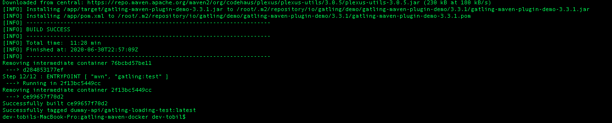</a>
    </p>
    <p align="center">Gambar 1. Build Image</p>

2. Docker Run
    <p align="center">
        <a href="" target="blank">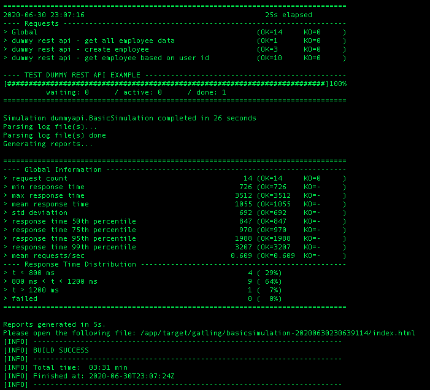</a>
    </p>
    <p align="center">Gambar 2. Cuplikan resume test</p>

3. Hasil Test Disimpan pada directory target : 
    ```bash
    Reports generated in 5s.
    Please open the following file: /app/target/gatling/basicsimulation-20200630230639114/index.html
    ```
    <p align="center">
        <a href="" target="blank">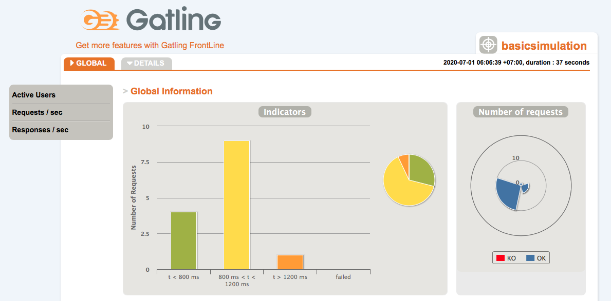</a>
    </p>
    <p align="center">Gambar 3. Grafik Hasil Test Keseluruhan</p>

    <p align="center">
        <a href="" target="blank">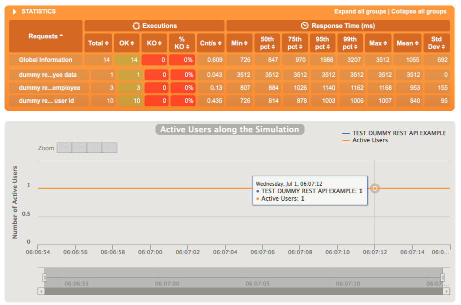</a>
    </p>
    <p align="center">Gambar 4. Active user</p>

    <p align="center">
        <a href="" target="blank">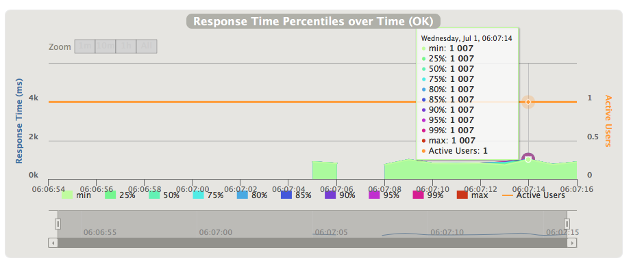</a>
    </p>
    <p align="center">Gambar 5. Percentile Response</p>

    <p align="center">
        <a href="" target="blank">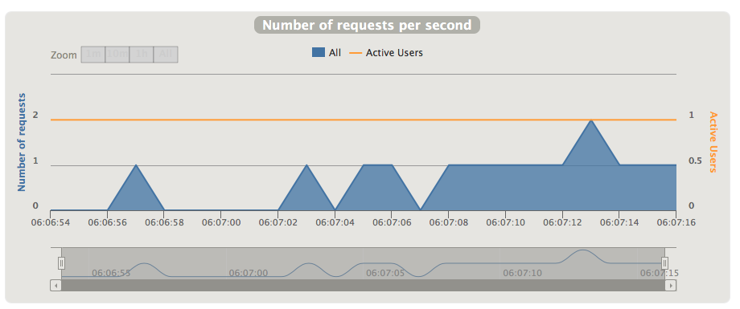</a>
    </p>
    <p align="center">Gambar 6. Request Per Second [RPS]</p>

    <p align="center">
        <a href="" target="blank">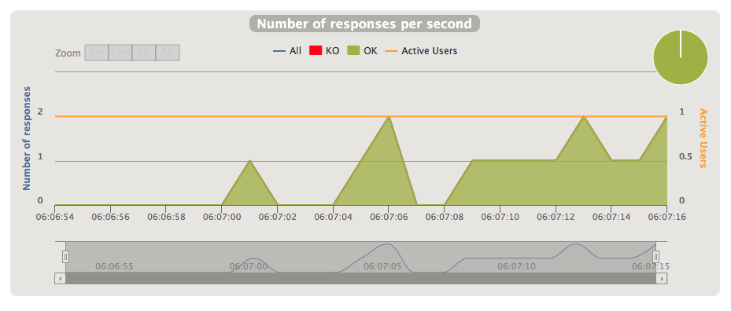</a>
    </p>
    <p align="center">Gambar 7. Response Per Second [RPS]</p>

4. Hasil Test Detail
    <p align="center">
        <a href="" target="blank">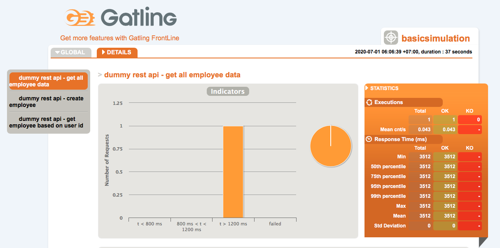</a>
    </p>
    <p align="center">Gambar 8. Detail Resume Get all employee</p>

    <p align="center">
        <a href="" target="blank">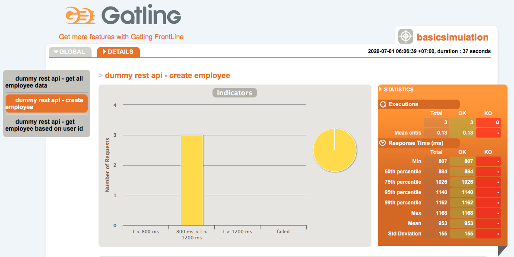</a>
    </p>
    <p align="center">Gambar 9. Detail Resume Post Create</p>

    <p align="center">
        <a href="" target="blank">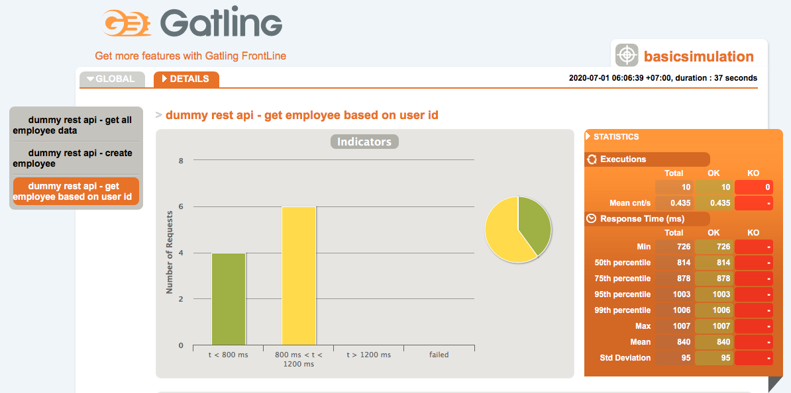</a>
    </p>
    <p align="center">Gambar 9. Detail Resume Get Single Data</p>


## KESIMPULAN
Dockerisasi project gatling maven akan memudahkan kita ketika menjalankan load test, terutama jika test dilakukan di server vps. Hasil Test Gatling disimpan pada directory target dan di bundle dalam bentuk halaman web, sehingga memudahkan kita dalam menganalisa hasil test lebih lanjut. Untuk Detail mengenai dokumentasi pada gatling, teman-teman bisa merujuk pada tautan refrensi di bawah ini. oiyah dependecny pada maven menggunakan scala versi 2.12


## REFERENSI
- [gatling - official doc](https://gatling.io)
- [gatling - maven plugin demo - github](https://github.com/gatling/gatling-maven-plugin-demo)
- [gatling - advanced tutorial](https://gatling.io/docs/current/advanced_tutorial/)
- [dummy rest-api](http://dummy.restapiexample.com/)
- [gatling - scala version issue](https://github.com/scala/bug/issues/11648)
- [error - heap memory](https://stackoverflow.com/questions/59392180/karate-gatling-how-to-resolve-java-heap-space-outofmemoryerror)


